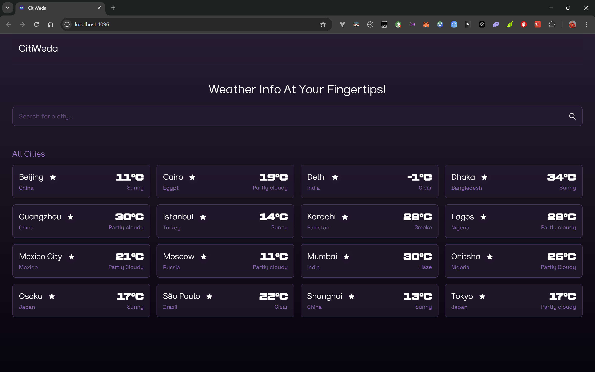
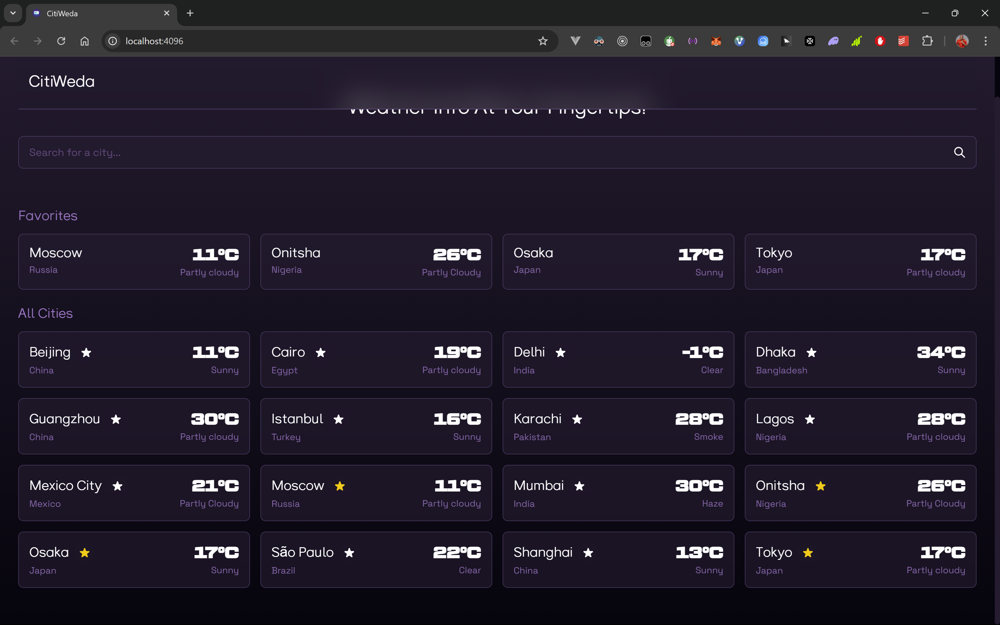
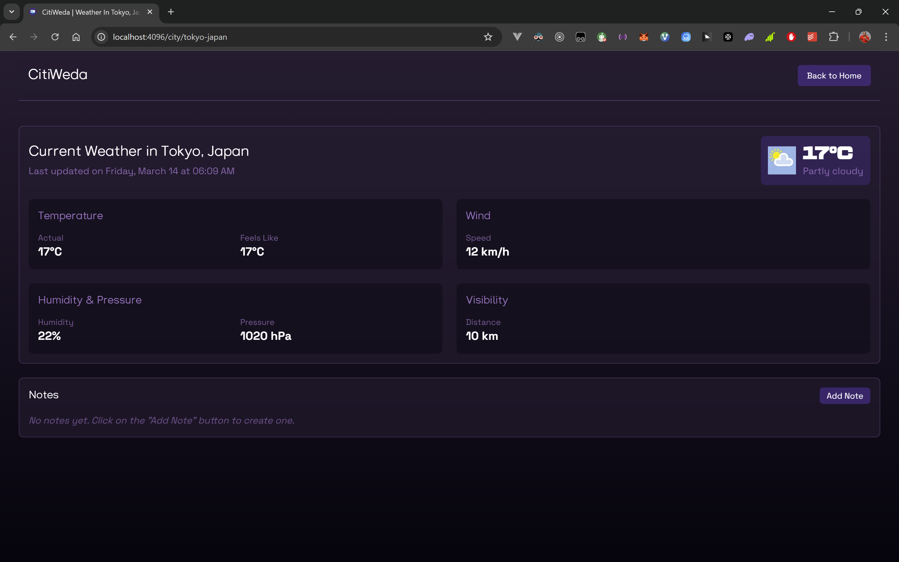
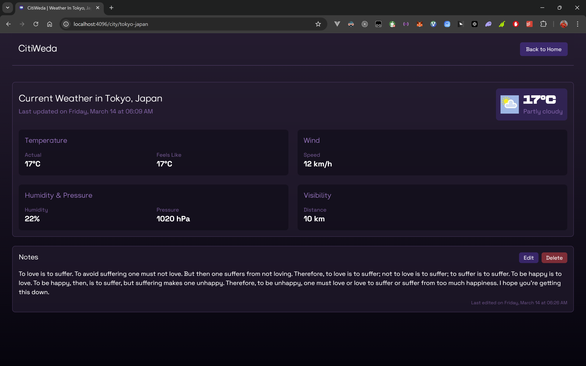

# CitiWeda

A modern weather application that provides real-time weather information for cities around the world, with favorites management, detailed weather views, and offline capabilities.

[](https://nextjs.org/)
[](https://www.typescriptlang.org/)
[](https://tailwindcss.com/)
[](https://jestjs.io/)
[](https://github.com/pmndrs/zustand)

## Table of Contents

- [Features](#features)
- [Screenshots](#screenshots)
- [Demo](#demo)
- [Technical Stack](#technical-stack)
- [Project Structure](#project-structure)
- [Setup and Installation](#setup-and-installation)
- [Environment Variables](#environment-variables)
- [Core Functionality](#core-functionality)
- [Testing](#testing)
- [Performance Optimizations](#performance-optimizations)
- [Browser Compatibility](#browser-compatibility)
- [Future Improvements](#future-improvements)

## Features

- **City Listings**: Display weather information for the world's 15 largest cities sorted alphabetically
- **Search System**: Find any city's weather data through the Weatherstack API
- **Favorites Management**: Add/remove cities to a favorites list for quick access
- **Detailed Weather Views**: Comprehensive weather information including temperature, wind, humidity, pressure, and visibility
- **Notes System**: Add, edit, and save personal notes for each city
- **Offline Support**: Cache weather data and user preferences in local storage for offline access
- **Geolocation**: Automatic detection of user's location (with permission)
- **Responsive Design**: Clean, modern UI that adapts to various screen sizes
- **Data Persistence**: Local storage for user preferences, favorites, and notes
- **Unit Testing**: Comprehensive Jest tests for components and functionality

## Screenshots


_Landing page showing a list of cities with weather information_


_Landing page with favorite cities section_


_Detailed weather information for a selected city_


_City weather details with user notes_

## Demo

A live demo of the application is available at [citiweda.vercel.app](https://citiweda.vercel.app).

## Technical Stack

- **Framework**: [Next.js 16](https://nextjs.org/) with App Router
- **Language**: [TypeScript 5.8](https://www.typescriptlang.org/)
- **Styling**: [Tailwind CSS 3.4](https://tailwindcss.com/) (No UI frameworks)
- **State Management**: [Zustand 5.0](https://github.com/pmndrs/zustand) with persist middleware
- **API**: [Weatherstack](https://weatherstack.com/) for weather data
- **Testing**: [Jest 29.7](https://jestjs.io/) & [React Testing Library 16.2](https://testing-library.com/docs/react-testing-library/intro/)
- **Browser APIs**: Geolocation API, Local Storage

## Project Structure

```
src/
├── __tests__/                  # Test files
│   └── components/             # Component tests
├── app/                        # Next.js app directory
│   ├── city/[id]/              # Weather info page for a city
│   ├── layout.tsx              # Root layout component
│   └── page.tsx                # Landing page
├── components/                 # React components
│   ├── CitiesSection.tsx       # Cities list component
│   ├── CityTile.tsx            # Individual city card
│   ├── Header.tsx              # Navigation header
│   ├── NotesSection.tsx        # Notes management component
│   ├── SearchBar.tsx           # Search functionality component
│   └── WeatherInfoPane.tsx     # Weather details component
├── constants/                  # Application constants
│   └── index.ts                # App name, default cities
├── services/                   # API services
│   └── weather-service.ts      # Weatherstack API integration
├── stores/                     # State management
│   └── main-store.ts           # Zustand store with persistence
├── types/                      # TypeScript type definitions
│   └── index.ts                # Shared types
└── utils/                      # Utility functions
    └── index.ts                # Logger, CSS utilities
```

## Setup and Installation

### Prerequisites

- Node.js 24 or higher
- npm or yarn

### Installation Steps

1. Install dependencies:

   ```bash
   npm install
   # or
   yarn install
   ```

2. Set up environment variables:
   Create a `.env.local` file in the root directory with:

   ```
   NEXT_PUBLIC_WEATHERSTACK_API_KEY=your_api_key_here
   ```

3. Run the development server:

   ```bash
   npm run dev
   # or
   yarn dev
   ```

4. Open [http://localhost:4096](http://localhost:4096) in your browser.

### Building for Production

```bash
npm run build
# or
yarn build
```

## Environment Variables

| Variable                           | Description               | Required |
| ---------------------------------- | ------------------------- | -------- |
| `NEXT_PUBLIC_WEATHERSTACK_API_KEY` | Your Weatherstack API key | Yes      |

## Core Functionality

### Weather API Integration

The application integrates with the Weatherstack API to fetch real-time weather data. Weather information is cached in local storage to enable offline functionality and reduce API calls.

```typescript
// Example of weather data retrieval
const response = await fetch(
  `https://api.weatherstack.com/current?access_key=${API_KEY}&query=${query}`
);
```

### State Management

Zustand is used for state management with the persist middleware to save state in local storage:

```typescript
import { create } from 'zustand';
import { persist } from 'zustand/middleware';

// Main store initialization
export const useMainStore = create<StoreState & StoreAction>()(
  persist(
    (setState, getState) => ({
      // Store actions and state...
    }),
    {
      name: 'main-store'
    }
  )
);
```

### Geolocation

The app requests permission to access the user's location and automatically fetches weather for their current city:

```typescript
navigator.geolocation.getCurrentPosition(
  async ({ coords: { latitude, longitude } }) => {
    // Get weather for user's location
  },
  () => setState({ isPermissionDenied: true })
);
```

### Offline Support

Data is persisted in local storage to provide functionality when offline:

- Weather data is cached with timestamps
- The app checks for stale data (older than 30 minutes) and refreshes when online
- Favorites and notes are stored locally

## Testing

Run the test suite with:

```bash
npm test
# or
yarn test
```

The test suite includes:

- Component tests using React Testing Library
- Mock implementations for external dependencies
- Unit tests for core functionality

## Performance Optimizations

- **Data Caching**: Weather data is cached to minimize API calls
- **Component Memoization**: React's useMemo and useCallback for performance
- **CSS Optimization**: Tailwind with purge for minimal CSS
- **Lazy Loading**: Dynamic imports for code splitting

## Browser Compatibility

- Chrome
- Firefox
- Safari
- Edge

## Future Improvements

- PWA capabilities for full offline experience
- Additional weather data visualization
- Weather forecast for upcoming days
- Weather alerts and notifications
- Dark/light theme toggle
- City comparison feature

---

## License

This project is for educational purposes. All rights reserved.

## Acknowledgements

- [Weatherstack API](https://weatherstack.com/) for weather data
- [Zustand](https://github.com/pmndrs/zustand) for state management
- [Tailwind CSS](https://tailwindcss.com/) for styling
- [Next.js](https://nextjs.org/) for framework
